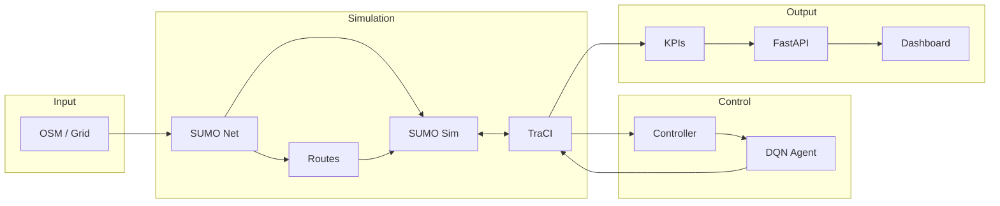
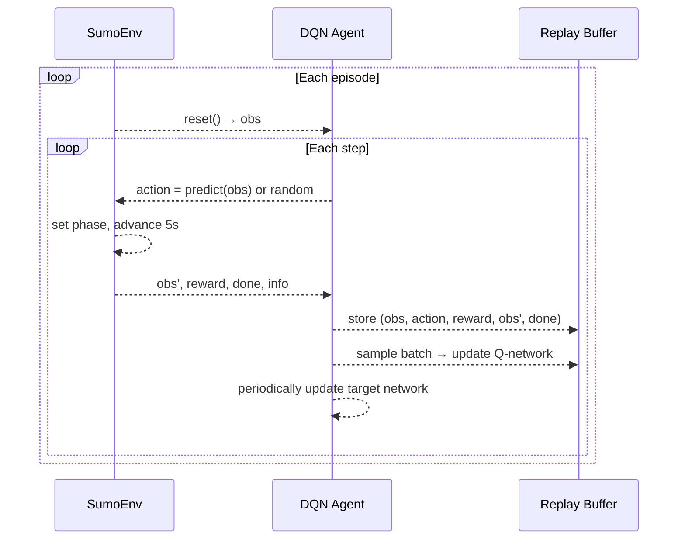
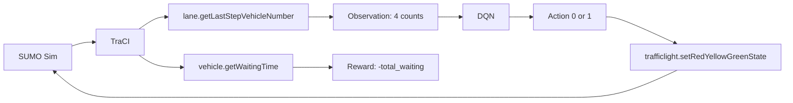
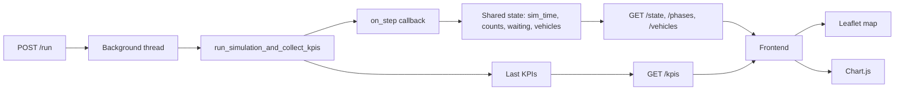
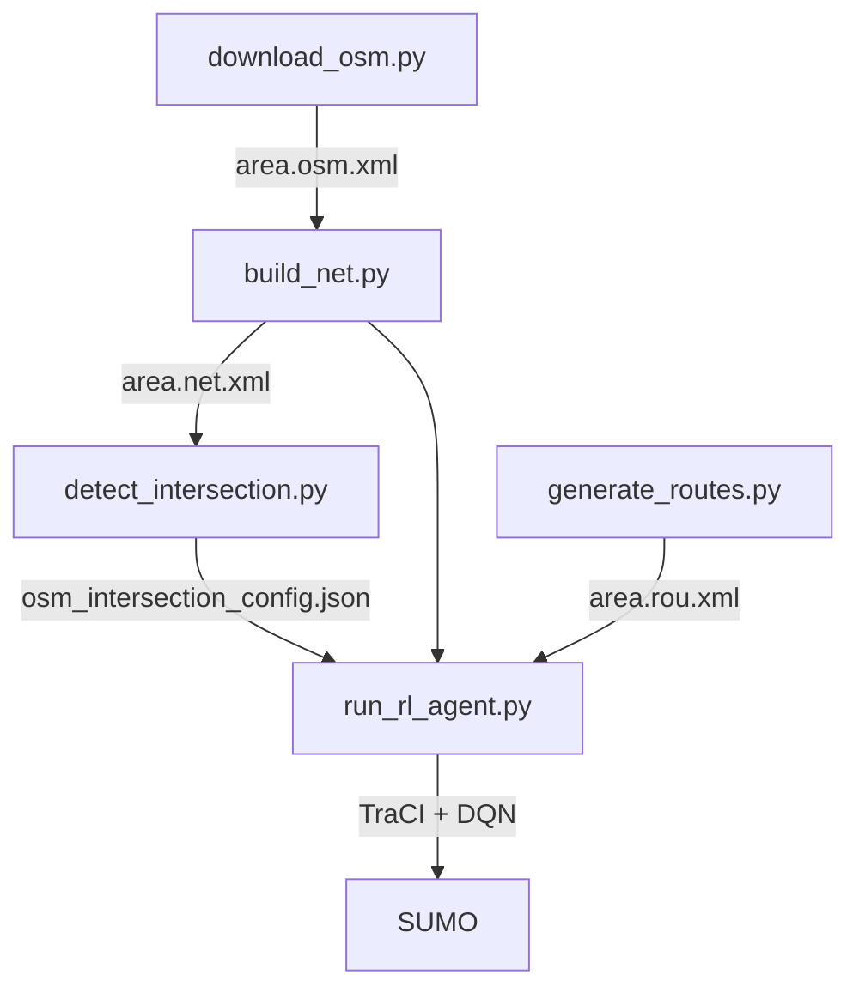

# Smart Traffic Light — Project guide

This document explains the project in detail: architecture, algorithms, AI training, visual workflows, analogies for each part, how to customize it, and how to test and see real results.

---

## 1. What this project does

The project **controls a single traffic light at an intersection** using **Reinforcement Learning (RL)**. A simulated city (SUMO) generates vehicles; an **RL agent (DQN)** decides every few seconds whether to show **North–South green** or **East–West green** so that **total waiting time** is minimized. The same pipeline can run on a **synthetic grid** (Phases 1–8) or on a **real map** from OpenStreetMap (Phase 9).

---

## 2. High-level pipeline (visual workflow)

End-to-end flow from map to dashboard:



**In words:** Map data (grid or OSM) becomes a SUMO network and routes. SUMO runs the simulation; **TraCI** is the link between Python and SUMO. The **controller** (fixed, random, or RL) sends phase commands via TraCI and reads vehicle/lane data. KPIs are computed from that data and served by the API; the **dashboard** shows the map, vehicles, and charts in real time.

---

## 3. Component analogies

| Component | Analogy | What it really is |
|-----------|---------|-------------------|
| **SUMO** | A **sandbox city** (roads, traffic rules, vehicles moving) | Microscopic traffic simulator: network (nodes, edges, lanes), routes, traffic lights, step-by-step physics. |
| **TraCI** | **Remote control** for the sandbox | API to start/step SUMO and read/write (e.g. vehicle positions, lane counts, traffic light state) from Python. |
| **Intersection B1** | The **crossroads** we control | One junction in the net with a traffic light; we decide which direction is green. |
| **Observation (lane counts)** | **Eyes** of the agent | Four numbers: how many vehicles are on each of the four incoming lanes to B1. |
| **Action (0 or 1)** | **Lever**: NS green vs EW green | Discrete choice: 0 = North–South green, 1 = East–West green (other directions red). |
| **Reward** | **Score**: “less waiting = better” | One number per step: minus total waiting time (so higher reward = less waiting). |
| **SumoEnv** | The **game** the agent plays | Gymnasium environment: `reset()` starts a run, `step(action)` applies a phase and returns next observation, reward, and done. |
| **DQN** | The **brain** that learns | Neural network that estimates “how good is action A in state S?” (Q-value); trained with past (state, action, reward) data. |
| **KPICollector** | **Scoreboard** for the run | Aggregates per-step data (waiting times, speeds, arrivals) and outputs summary metrics (average waiting, throughput, etc.). |
| **FastAPI** | **Reception desk** for the app | HTTP server that runs a simulation in the background and answers: “What’s the state? KPIs? Start a run.” |
| **Dashboard** | **Live TV** of the simulation | Web page: map with vehicles, charts (waiting, speed, reward), current phase; polls the API. |

---

## 4. Algorithms and AI training

### 4.1 Problem as a Markov Decision Process (MDP)

We model traffic light control as an **MDP**:

- **State (observation)** \( s \): vector of **4 lane vehicle counts** at the controlled intersection (B1).  
  \( s \in [0, 100]^4 \) (float32).  
  *“How many vehicles are waiting on each approach?”*

- **Action** \( a \): **0** = North–South green, **1** = East–West green.  
  \( a \in \{0, 1\} \).

- **Reward** \( r \): **negative total waiting time** (sum over all vehicles in the network at that step).  
  \( r = -\text{total\_waiting\_time} \).  
  So **maximizing reward = minimizing waiting**.

- **Transition**: SUMO advances the simulation for a fixed **control interval** (e.g. 5 s) with the chosen phase; the next state is the new lane counts. Episodes end at a fixed sim time (e.g. 360 s) or max steps.

**Goal:** Learn a policy \( \pi(a|s) \) that chooses the green phase so that cumulative reward (over an episode) is as high as possible, i.e. total waiting time is as low as possible.

### 4.2 DQN (Deep Q-Network)

We use **Stable-Baselines3 DQN**, which implements:

1. **Q-learning**: The agent learns \( Q(s,a) \) = “expected future reward if I take action \( a \) in state \( s \) and then act optimally.” The policy is: choose \( a \) that maximizes \( Q(s,a) \).

2. **Neural network**: \( Q(s,a) \) is approximated by a small **MLP** (e.g. two hidden layers of 64 units). Input = state (4 dims), output = one value per action (2 values).

3. **Experience replay**: Past transitions \( (s, a, r, s') \) are stored in a **replay buffer**. Training uses random **batches** from this buffer (e.g. 32 samples) to update the network. This breaks correlation between consecutive steps and stabilizes learning.

4. **Target network**: A copy of the Q-network is updated periodically (e.g. every 500 steps). The **TD target** for an update uses this target network, which reduces moving targets and helps stability.

5. **Exploration**: During training, the agent sometimes takes a **random action** (ε-greedy). Exploration starts high (e.g. 100% random) and decays to a small value (e.g. 5%) over the first 20% of training.

**Main hyperparameters (in `rl/train_dqn.py`):**

| Parameter | Value | Role |
|-----------|--------|------|
| `learning_rate` | 5e-4 | Step size for gradient updates |
| `buffer_size` | 10,000 | Replay buffer size |
| `batch_size` | 32 | Samples per gradient step |
| `gamma` | 0.99 | Discount factor (future reward weight) |
| `exploration_fraction` | 0.2 | Fraction of steps with decaying ε |
| `exploration_final_eps` | 0.05 | Final random action probability |
| `target_update_interval` | 500 | Steps between target network updates |
| `policy_kwargs: net_arch` | [64, 64] | Hidden layer sizes |

### 4.3 Training loop (visual)



**What you see when training:** Console logs from SB3 (e.g. `ep_rew_mean`, `loss`) and at the end a saved model file `rl/models/dqn_traffic_light.zip`.

---

## 5. Data flow: where numbers come from

### 5.1 From SUMO to the agent



- **Observation**: For each of the four B1 incoming lanes (`A1B1_0`, `B0B1_0`, `B2B1_0`, `C1B1_0`), TraCI returns `getLastStepVehicleNumber(lane_id)`. These four integers form the state (as float32).
- **Reward**: Sum of `getWaitingTime(veh_id)` over all vehicles; reward = minus this sum.
- **Action**: 0 → set phase to `B1_PHASES[0]` (NS green), 1 → `B1_PHASES[2]` (EW green).

### 5.2 From simulation to dashboard



The backend runs one simulation in a thread. Each step it calls `on_step`, which updates shared variables (sim time, lane counts, total waiting, queue length, average speed, vehicle positions). The frontend polls `/state`, `/phases`, `/vehicles` every 500 ms and updates the map and charts. After the run, `/kpis` returns the final KPI object.

---

## 6. Phase 9: OSM workflow

When using a **real map** (OpenStreetMap):



1. **download_osm.py**: Overpass API → OSM XML for a bounding box.
2. **build_net.py**: netconvert turns OSM into a SUMO network.
3. **detect_intersection.py**: Finds one traffic-light junction in the net, extracts its lanes and phase list, picks two “green” phase indices → config file.
4. **generate_routes.py**: randomTrips + duarouter → route file.
5. **run_rl_agent.py**: Loads config and the **same** DQN; maps config’s incoming lanes to a 4-dim observation (pad/truncate); runs SUMO with the OSM net and routes; each control step: get counts → predict action → set phase.

The **trained model is not retrained** on OSM; we reuse it and adapt the observation (lane count vector length) so the existing 4-input DQN still receives 4 numbers.

---

## 7. Customization guide (with concrete examples)

### 7.1 Change the simulated network (grid)

**Where:** `sumo/generate_network.py` (and possibly `sumo/intersection.nod.xml`, `intersection.edg.xml` if using netconvert fallback).

**Example:** Larger grid (e.g. 5×5). In `generate_network.py`, find the netgenerate call and change grid size (e.g. `--grid.number` or equivalent). If the **center junction** changes, update `rl/sumo_utils.py`: `CONTROLLED_TL_ID`, `B1_INCOMING_LANES`, `B1_PHASES`, `GREEN_PHASE_INDICES` to match the new junction’s IDs and phase list from the generated net.

**Analogy:** Changing the “sandbox” layout; you must tell the controller which crossroads and which lanes to use.

### 7.2 Change the OSM area

**Where:** `sumo_osm/download_osm.py` (e.g. `--bbox min_lat min_lon max_lat max_lon`).

**Example:** Another city:
```bash
python sumo_osm/download_osm.py --bbox 33.58  -7.62  33.60  -7.60
```
Then run `build_net.py`, `detect_intersection.py`, `generate_routes.py`, `run_rl_agent.py` as usual. The **config** (tl_id, incoming_lanes, phases) is regenerated by `detect_intersection.py`.

### 7.3 Change the reward

**Where:** `rl/sumo_env.py`, inside `step()`, line where `reward = -total_waiting`.

**Example:** Add a small bonus for throughput (e.g. number of arrived vehicles in the step):
```python
# In step(), after total_waiting and obs:
arrived_this_step = ...  # e.g. from info or a counter
reward = -total_waiting + 0.1 * arrived_this_step
```
Then retrain the DQN; the policy will shift toward reducing waiting while slightly favoring more completions.

**Analogy:** Changing the “score” rule of the game so the agent optimizes a different mix of objectives.

### 7.4 Change the observation (e.g. add speed)

**Where:** `rl/sumo_env.py`: `_get_obs()`, `observation_space`; and anywhere that assumes 4 dims (e.g. `run_rl_agent.py` for OSM pads to 4).

**Example:** Add average speed as 5th dimension:
- In `_get_obs()`: append `_get_avg_speed()` to the 4 lane counts → shape (5,).
- Set `observation_space = gym.spaces.Box(..., shape=(5,), ...)`.
- **Retrain** the DQN (input size changed). For Phase 9, in `run_rl_agent.py`, build `obs` as 5-dim (e.g. 4 lane counts + 1 speed) instead of padding to 4.

**Analogy:** Giving the agent an extra “sensor” (average speed); the brain (DQN) must be retrained with 5 inputs.

### 7.5 Change DQN hyperparameters

**Where:** `rl/train_dqn.py`, inside the `DQN(...)` constructor.

**Example:** Deeper network and longer exploration:
```python
model = DQN(
    "MlpPolicy",
    env,
    learning_rate=1e-4,
    buffer_size=50_000,
    exploration_fraction=0.3,
    exploration_final_eps=0.02,
    policy_kwargs=dict(net_arch=[128, 128, 64]),
    ...
)
```
Then run `python rl/train_dqn.py --timesteps 50000 --save-path rl/models/dqn_custom`.

### 7.6 Add a third phase (e.g. all-red or a dedicated turn)

**Where:**  
- SUMO net: the junction’s `tlLogic` must define the phases (e.g. in `intersection.net.xml` or generated by netconvert).  
- `rl/sumo_utils.py`: `B1_PHASES` and `GREEN_PHASE_INDICES` (e.g. indices 0, 1, 2 for three choices).  
- `rl/sumo_env.py`: `action_space = gym.spaces.Discrete(3)`, and `_set_phase(action)` maps action to the correct phase index.  
- `rl/train_dqn.py`: no change to DQN constructor (action space is read from env).  
- Retrain; for OSM, `detect_intersection.py` already can output more than two green indices (you’d use the first three or adapt `run_rl_agent.py` to 3 actions).

**Analogy:** Adding another lever (e.g. “North–South”, “East–West”, “All red”); the agent now has 3 actions and must learn when to use each.

### 7.7 Add or change KPIs

**Where:** `backend/kpi_service.py`: `KPICollector.update()` and `get_results()`.

**Example:** Add “max queue length” over the run. In `KPICollector`: add `self.max_queue = 0` in `__init__`; in `update()` receive queue length (or compute from lane halting counts) and do `self.max_queue = max(self.max_queue, queue_length)`; in `get_results()` add `"max_queue_length": self.max_queue`. The API’s GET `/kpis` will then expose this field.

---

## 8. How to test and see real results

### 8.1 Quick checklist (per phase)

Use **TESTING.md** for the exact commands. Summary:

| Phase | What to run | Where to look for results |
|-------|-------------|----------------------------|
| 1 | `python sumo/generate_network.py` then `sumo-gui -c sumo/simulation.sumocfg` | SUMO window: vehicles and fixed-time lights. |
| 2 | `python sumo/traci_manual_control.py --steps 60` | Console: lane counts and phase changes every 30 s. |
| 3 | `python rl/random_agent.py --steps 120` | Console: waiting time, queue length, avg speed; optional CSV. |
| 4 | `python rl/sumo_env.py` | Console: observations (4 numbers) and rewards per step. |
| 5 | `python rl/train_dqn.py` then `python rl/evaluate.py` | Console: training logs; evaluation table (waiting time, queue, reward for fixed / random / RL). |
| 6 | `python backend/kpi_service.py --controller rl --sim-end 120` | Console: JSON with average_waiting_time, throughput, average_speed, etc. |
| 7 | `uvicorn backend.main:app --port 8000` + `curl` to `/run`, `/state`, `/kpis` | Terminal: JSON responses; browser: http://127.0.0.1:8000/docs. |
| 8 | Backend + open http://127.0.0.1:8000/dashboard | Browser: map with vehicles, charts (waiting, speed, reward), phase badge. |
| 9 | `sumo_osm/` scripts then `python sumo_osm/run_rl_agent.py` | Console: “Step N sim_time=… total_waiting=… reward=…” and final total reward. |

### 8.2 Interpreting results

- **Training (Phase 5):** `ep_rew_mean` in the log is mean episode reward (negative = waiting). Over time it should tend to become **less negative** (less waiting) as the agent learns.
- **Evaluation (Phase 5):** Compare **mean waiting time** and **total reward** across fixed-time, random, and RL. A good RL run should have **lower mean waiting** and **higher total reward** than random; often better than fixed-time if demand is uneven.
- **KPIs (Phase 6 / 7):**  
  - **average_waiting_time**: Lower is better.  
  - **throughput**: Vehicles per hour; higher can mean better flow.  
  - **average_speed**: Higher is better (less congestion).  
  - **number_of_phase_switches**: Many switches can mean responsive control; too many can mean instability (interpret with waiting/speed).
- **Dashboard (Phase 8):**  
  - **Charts**: “Total waiting” should roughly track congestion; “Reward” ≈ −waiting.  
  - **Map**: Vehicles (blue circles) moving through the intersection; phase badge shows NS vs EW green.
- **Phase 9:** Console output shows per-control-step waiting and reward; “Done. Total reward=…” is the cumulative reward for the OSM run. Compare with a fixed-time run on the same net (e.g. by temporarily using a fixed controller in the same script) to see if the RL agent helps.

### 8.3 Minimal “see it work” sequence

1. **Train (once):**  
   `pip install -r requirements.txt`  
   `python rl/train_dqn.py --timesteps 10000`

2. **Evaluate:**  
   `python rl/evaluate.py`  
   → Table with fixed / random / RL; check that RL has better (higher) reward and often lower waiting.

3. **Dashboard:**  
   `uvicorn backend.main:app --host 0.0.0.0 --port 8000`  
   Open http://127.0.0.1:8000/dashboard → Start simulation (e.g. RL, 120 s) → watch map and charts update in real time.

4. **OSM (optional):**  
   Run Phase 9 commands from TESTING.md; after `run_rl_agent.py`, check the printed total reward and step-wise waiting times.

---

## 9. File map (where to look for what)

| Goal | File(s) |
|------|---------|
| Network (grid) generation | `sumo/generate_network.py`, `sumo/intersection.net.xml` |
| B1 junction and phases | `rl/sumo_utils.py` |
| Observation & reward | `rl/sumo_env.py` |
| DQN training | `rl/train_dqn.py` |
| Compare controllers | `rl/evaluate.py` |
| KPI definitions | `backend/kpi_service.py` |
| API and shared state | `backend/main.py` |
| Dashboard UI | `frontend/index.html`, `frontend/app.js`, `frontend/styles.css` |
| OSM → net → config → routes | `sumo_osm/download_osm.py`, `build_net.py`, `detect_intersection.py`, `generate_routes.py` |
| Run RL on OSM | `sumo_osm/run_rl_agent.py` |
| Test commands | `TESTING.md` |
| High-level README | `README.md` |

---

This guide, together with **README.md** (setup and phase descriptions) and **TESTING.md** (commands), gives you a full picture of the project, the algorithms, how to customize it, and how to test and interpret real results.
