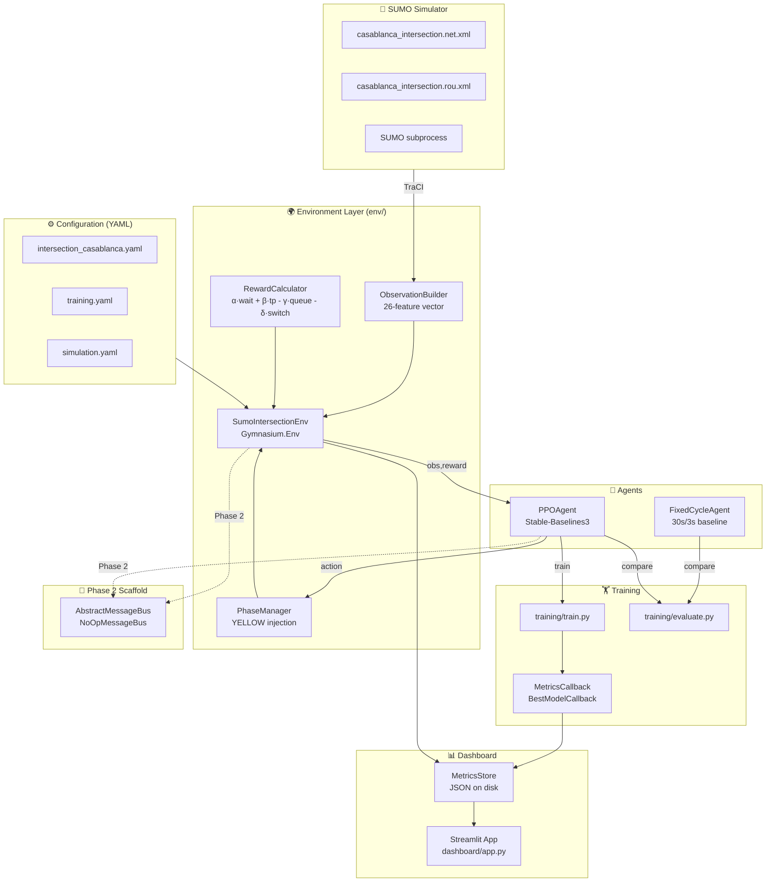

# NeuroTraffic-RL Architecture Diagram

## System Overview



## Phase 1 → Phase 2 Transition

```mermaid
graph LR
    A["Phase 1\nSingle Intersection\nNoOpMessageBus"] 
    -->|"Replace NoOpMessageBus\nwith RedisMessageBus"| 
    B["Phase 2\nMulti-Intersection\nCoordinated Agents"]
    
    B --> C["Phase 3\nSmart City\nHierarchical Control"]
```
